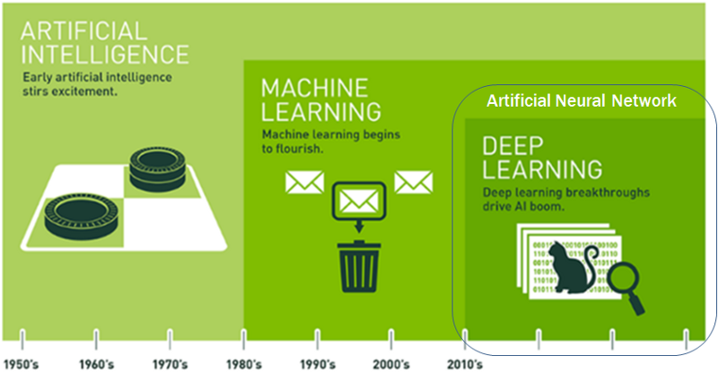

# iot-dataanalysis-2025
2025년 IoT 개발자 과정 빅데이터분석 리포지토리

# 1일차 

### 머신러닝/딥러닝

(출처 : NVIDIA)

- 인공지능(Artificial Intelligence: AI)의 분야
    - 컴퓨터가 사람의 행동을 흉내내는 모든 기술

- 머신러닝
    - 인공지능 하위 집합
    - 통계적 방법을 이용, 기계를 학습시키는 인공지능 기술

- 딥러닝
    - 머신러닝의 하위 집합
    - 신경망 기술을 이용, 머신러닝 기술 중 하나

- 인공지능 역사
    - 1943 - MCP뉴런 이론
    - 1950 - 튜링(앨런 튜링) 테스트, 인공지능 테스트
    - 1957 - 퍼셉트론 이론

## 8일차